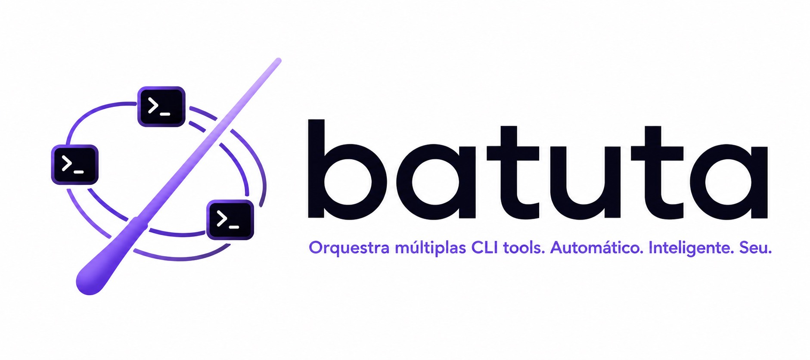

<p align="center">
  
</p>

> **Quem rege não toca.**

**Batuta** é um framework leve de orquestração para o [Claude Code](https://claude.com/claude-code). O Claude atua como **maestro**: entende a tarefa, escolhe o executor de código mais barato que dá conta, monta o contexto, delega, verifica o resultado e faz o commit. Quem escreve o código são os **instrumentistas** — CLIs como `codex`, `opencode` (com Kimi, DeepSeek e outros modelos baratos) ou o próprio Claude, quando a tarefa exige.

O resultado: você usa a inteligência do Claude onde ela importa (decidir, revisar, garantir qualidade) e gasta centavos onde qualquer modelo resolve (escrever o código de uma tarefa bem especificada).

> **Nota:** o v1 usa o Claude como maestro fixo, mas essa é uma decisão de foco, não de arquitetura — a direção do projeto é permitir configurar qualquer ferramenta como orquestrador no futuro.

## Por que o Batuta existe

Frameworks de orquestração para agentes de IA costumam cair em dois extremos:

- **Pesados demais** — fases obrigatórias, dezenas de subagentes, artefatos de planejamento para qualquer tarefinha, e tudo rodando no modelo mais caro.
- **Leves demais** — nenhuma garantia: sem estado, sem verificação, sem rastreabilidade. Se der errado, boa sorte no `git reflog`.

O Batuta fica no meio: **um ciclo único e enxuto** que preserva as quatro garantias que importam, e nada além delas.

| Garantia | Como funciona |
|---|---|
| ✅ **Commits atômicos** | Cada tarefa verificada vira um commit. Desfazer é trivial. |
| ✅ **Estado retomável** | Um único `WORK.md` em prosa. Feche o terminal, volte amanhã, continue. |
| ✅ **Plano quando precisa** | Tarefa clara vai direto. Tarefa ambígua ganha 2-3 perguntas. Trabalho longo ganha plano formal. |
| ✅ **Verificação sempre** | Todo diff passa por review + testes + critérios de aceite antes do commit. |

## Como funciona

```
        você: "corrige o bug do login que dá 500 quando o email tem +"
          │
          ▼
   ┌─────────────┐    classifica: tarefa média
   │   CLAUDE    │──► roteia: → codex (assinatura ChatGPT, já paga)
   │  (maestro)  │    monta o brief: contexto + arquivos + critérios de aceite
   └──────┬──────┘
          │ delega
          ▼
   ┌─────────────┐
   │    CODEX    │──► escreve o código
   └──────┬──────┘
          │ diff
          ▼
   ┌─────────────┐    revisa o diff
   │   CLAUDE    │──► roda os testes
   │  (maestro)  │    confere os critérios de aceite
   └──────┬──────┘
          │ ✅ passou
          ▼
    commit atômico + linha no WORK.md
```

Se a verificação falhar, o executor recebe o feedback e tenta **uma vez** de novo. Falhou de novo? A tarefa **escala automaticamente** para um executor mais capaz.

## Roteamento por complexidade

O coração do Batuta é uma tabela simples — que você edita como quiser:

| Complexidade | Exemplos | Executor | Custo |
|---|---|---|---|
| **Trivial** | rename, config, texto, teste simples | `opencode` + Kimi/DeepSeek | centavos (API) |
| **Média** | feature isolada, bugfix com repro clara | `codex` | assinatura ChatGPT |
| **Complexa** | multi-arquivo, arquitetura, segurança | Claude executa | assinatura Claude |

O Claude classifica e informa a decisão em uma linha (`→ codex: bugfix médio`). Não gostou? É só falar: *"usa o kimi pra isso"*.

## Comandos

| Comando | O que faz |
|---|---|
| `/batuta` | Entrada principal. Na 1ª vez no projeto, roda o onboarding; depois, classifica, roteia e executa |
| `/batuta:plan` | Força um plano formal aprovável (para trabalhos longos, que atravessam sessões) |
| `/batuta:status` | Mostra o `WORK.md`, as tarefas em background e a leitura de roteamento (tarefas por lane, taxa de delegação e de escalada) |
| `/batuta:route` | Exibe e edita a tabela de roteamento |
| `/batuta:review` | Re-executa a verificação sobre qualquer diff, sob demanda |

## Onboarding: o Batuta conhece o seu projeto

Na **primeira execução** em um projeto, o Batuta faz 3-5 perguntas rápidas:

- Qual a stack? (React, Vue, Node API... — ele detecta pelo `package.json` e sugere)
- Qual a metodologia? (TDD ou testes depois; conventional commits ou livre)
- Qual o comando de testes e de build?

Ele também **checa quais executores você tem** (codex? opencode? logados?) e confirma o modelo barato da lane trivial — assim a tabela de roteamento do seu projeto já nasce com modelos explícitos, e você descobre na hora (não no meio de uma tarefa) se falta instalar algo.

As respostas viram o `.batuta/profile.md`, e as convenções da sua stack (via templates inclusos) entram **automaticamente em todo brief** enviado aos executores. Ou seja: o codex e o kimi seguem as regras do *seu* projeto sem você repetir nada.

O perfil também guarda um **mapa curto do projeto** (onde ficam rotas, componentes, testes…), montado no onboarding e atualizado como efeito colateral do trabalho — nada de fase de mapeamento nem mapa gigante que envelhece.

**Vindo de outro framework?** Se o Batuta encontrar artefatos de um GSD da vida (`.planning/`, roadmaps), ele oferece importar o estado: o que estava em andamento vira `WORK.md`, o que falta vira plano. Seus artefatos antigos ficam intocados.

## Paralelismo

Tarefas independentes rodam **em paralelo**: cada executor em background, com um git worktree próprio quando há risco de conflito. Se você tiver o plugin [superpowers](https://github.com/obra/superpowers) instalado, o Batuta usa as skills dele para reger a distribuição; sem ele, usa os recursos nativos do Claude Code. Nenhuma dependência obrigatória.

## Adicionando um executor novo

Sem código, sem PR no framework. Adicionar um executor é:

1. Copiar `adapters/_template.md` → `adapters/meu-cli.md`
2. Preencher: como invocar em modo não-interativo, como passar contexto, custo, limites
3. Adicionar uma linha na tabela do `routing.md`

Pronto — o maestro já pode delegar para ele.

## Estado: um arquivo, zero cerimônia

```markdown
# WORK — meu-projeto

## Em andamento
- [ ] refatorar auth para suportar OAuth → codex (delegada 2026-07-19)

## Feito
- [x] corrigir 500 no login com email contendo + → kimi, commit abc123
```

Prosa e checkboxes. Sem tabelas com schema rígido, sem validação que quebra com um caractere fora do lugar.

Repare que cada linha do Feito conta a história completa: **qual executor, qual modelo, e se precisou escalar**. Isso é o diário de regência do projeto — e é o que alimenta a resposta da próxima seção.

## Quanto estou economizando?

O Batuta não inventa contabilidade: ele não tem como saber quantos tokens cada CLI gastou nem o preço de cada um — qualquer número em reais que ele cuspisse seria chute vestido de medição. O que ele faz é melhor: **registra fatos e deixa você tirar a conta**.

Pergunte `/batuta:status` e ele lê o `WORK.md` e responde com fatos:

> 23 tarefas concluídas: 14 triviais (kimi), 6 médias (codex), 3 complexas (claude).
> **87% do código deste projeto não gastou sua assinatura Claude.**
> 2 escaladas saindo da lane trivial — considere um modelo mais forte ou classificação mais conservadora.

Três leituras práticas disso:

- **Taxa de delegação** — o contrafactual é evidente: sem o Batuta, 100% dessas tarefas rodariam no Claude. Cada tarefa desviada é franquia da sua assinatura que sobra para o que realmente precisa dela (e limite semanal que você para de estourar).
- **Taxa de escalada** — o sinal acionável. Escalada frequente = você pagou duas vezes; o botão de ajuste é a tabela de roteamento, que é sua.
- **Reais, se você quiser** — coloque seus preços de referência na coluna de custo do seu `routing.md` e o `/batuta:status` faz a multiplicação — deixando claro que as premissas são suas.

## Instalação

Dentro do Claude Code:

```
/plugin marketplace add franciscpd/batuta
/plugin install batuta@batuta
```

Ou pelo terminal:

```bash
claude plugin marketplace add franciscpd/batuta
claude plugin install batuta@batuta
```

Depois é só abrir um projeto e invocar `/batuta` — a primeira execução roda o onboarding.

Pré-requisitos:

- [Claude Code](https://claude.com/claude-code) (o maestro)
- Pelo menos um executor instalado e logado: [codex CLI](https://github.com/openai/codex), [opencode](https://opencode.ai) ou apenas o próprio Claude — sem um executor barato, tudo colapsa para a lane do Claude e você perde justamente a graça

> 🚧 **v0.1.0 em fase de teste** — o desenho está no [PRD](docs/PRD.md); feedback e issues são bem-vindos.

## Filosofia

1. **Quem rege não toca** — o orquestrador gasta tokens dirigindo, não digitando código.
2. **O processo pesa o mínimo que a tarefa permitir** — planejamento é adaptativo, nunca pré-requisito.
3. **Estado é prosa, não schema** — nada que quebre com um pipe não escapado.
4. **Toda entrega passa por verificação** — sempre, sem exceção.
5. **Extensível por arquivo, não por código** — novo executor = novo arquivo markdown.

## Identidade visual

O guia completo da marca — conceito (batuta + ferramentas CLI + orquestração), paleta, tipografia e aplicações — está em [`docs/assets/brand-guide.jpg`](docs/assets/brand-guide.jpg).

## Inspirações

- [andrej-karpathy-skills](https://github.com/multica-ai/andrej-karpathy-skills) — princípios comportamentais contra vícios clássicos de LLMs escrevendo código, derivados das [observações do Andrej Karpathy](https://x.com/karpathy/status/2015883857489522876). O Batuta incorpora três deles nos briefs e na verificação: critérios de aceite como metas verificáveis, o teste de rastreabilidade do diff (cada linha alterada rastreia até o pedido) e a regra dos órfãos (limpe só a bagunça que a sua mudança criou).
- Frameworks de processo como o [GSD](https://github.com/gsd-build/get-shit-done) — pelo que ensinaram sobre garantias que valem a pena (commits atômicos, estado retomável, verificação) e sobre o peso de processo que não vale.

## Contribuindo

O projeto está no começo — o melhor jeito de contribuir agora é ler o [PRD](docs/PRD.md) e abrir uma issue com ideias, críticas ou casos de uso. Feito por e para desenvolvedores brasileiros 🇧🇷, mas contribuições de qualquer lugar são bem-vindas.

## Licença

[MIT](LICENSE)
